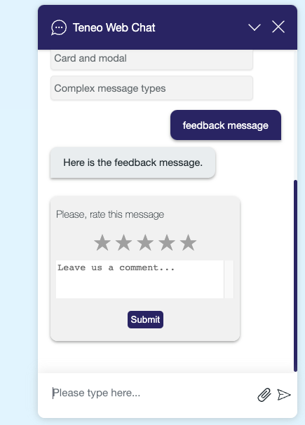
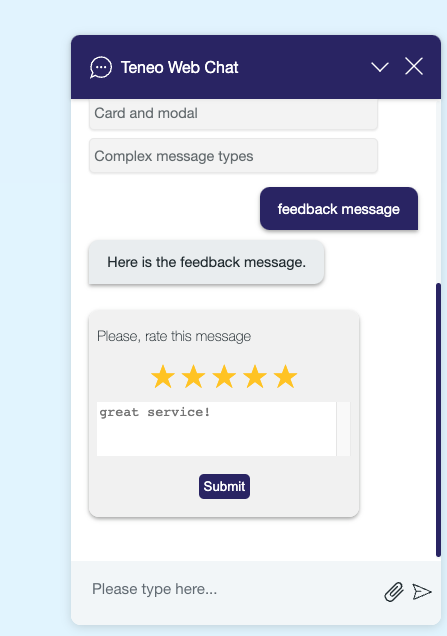
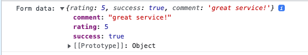

# Rating Message Component

The Rating Message Component is a new addition to TWC that enables users to rate an item or experience using a personalized scale and share their feedback through comments, enhancing user engagement and allowing customers to express their opinions more effectively. The general logic behind the component is that once the desired qualification range has been selected, clicking on the submit button returns the associated numerical value to the solution, which is stored in a variable. Overall, this new component provides users with a simple and efficient way to rate a product or service on a customizable scale and leave a comment if desired.

## Overview
The rating message feature consists of a form that displays a rating scale using stars and an optional comment section. Users can select a rating by clicking on the stars and provide additional feedback through the comment textarea. Upon submission, the selected rating and comment (if provided) are sent as form data.

### Props
The rating message component accepts the following props:

| Prop             | Type          | Description |
|----------------------|---------------|-------------|
| `message`       | String        | __Required__.The rating message object containing specific properties. |

The `message` object should have the following properties:
| Property             | Type          | Description |
|----------------------|---------------|-------------|
| `type`       | String        | __Required__.Indicates the type of message. Must be set to `'rating'`. |
| `data`       | Object        | __Required__.Contains the data for the rating message, including the title, maximum value, and commentsAllowed.
 |

The `data` object should have the following properties:

| Property             | Type          | Description |
|----------------------|---------------|-------------|
| `title`       | String        | __Required__. The title or prompt for the rating message.|
| `maxValue`       | Number        | __Required__. The maximum value or rating scale for the rating.|
 | `commentsAllowed`       | Boolean        | __Required__. Indicates whether comments or additional feedback are allowed. Set to `true` or `false`. |

### Events
The rating message component emits the following events:

| Event             | Payload          | Description |
|----------------------|---------------|-------------|
| submit       | FormData        | Triggered when the form is submitted. The payload contains the form data.
