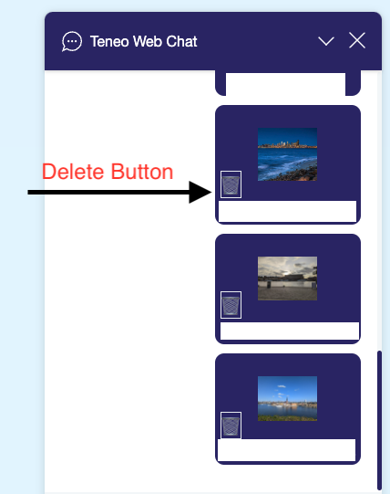
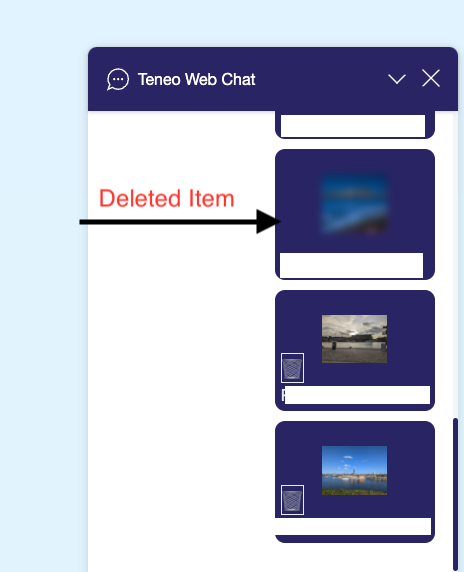
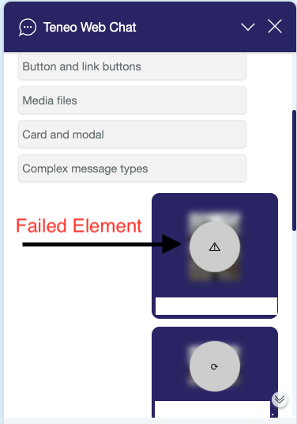
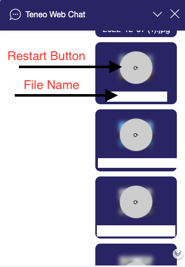

# TWC file upload interface

## Overview
The Teneo Web Chat (TWC) provides visual components and API methods to facilitate file upload to 3rd party services, offering a similar experience to sending images and files through popular messaging apps such as WhatsApp and Telegram. However, it's important to note that the file upload procedure itself is service-specific and is not included in the TWC file upload interface. Instead, TWC focuses on seamless integration of 3rd party file upload functionality.

## Key Components

### Upload Panel
The upload panel is a visual component that provides users with a convenient way to select files for upload. It offers a user-friendly graphical interface that allows users to choose files from their devices in an intuitive manner.

In addition to the standard file selector dialog, the upload panel also provides support for file drag-and-drop and copy-paste functionality. This feature is compatible with most commonly used browsers on both desktop and mobile devices. However, please note that in the current implementation, file copy-paste functionality may not work in Firefox.

#### Methods
The upload panel component provides the following methods for interacting with it:

#### Show upload panel {#methods_show-upload-panel}

This method displays the upload panel, either empty or pre-populated with content.

To display an empty upload panel, use the following:
```javascript
TeneoWebChat.call('show_upload_panel')
```

To display a pre-populated upload panel, pass the desired content as a parameter, like this:
```javascript
TeneoWebChat.call('show_upload_panel', content)
```

##### The payload of the `content` argument {#methods_show-upload-panel_content-payload}
The content argument passed to the show_upload_panel method should be an object with the following structure:

| Property             | Type          | Description |
|----------------------|---------------|-------------|
| `items`              | object\[\]    | __Required__ . An array of items representing the files to be added to the panel. |

Each object in the `items` array should have the following properties:


| Property             | Type          | Description |
|----------------------|---------------|-------------|
| `file`               | File          | __Required__ . The [File](https://developer.mozilla.org/en-US/docs/Web/API/File) object representing the file to be added. |
| `id`                 | string        | __Required__ . A randomly generated unique string used as the identifier for this file. |
| `asImage`            | boolean       | _Optional_. If set to a truthy value, the panel will attempt to display the file as an image. If absent, `undefined`, or `null`, the MIME type of the file (`file` property) will determine if it should be displayed as an image. If set to a falsy value (other than `undefined` or `null`), the file will not be displayed as an image, even if it has an image MIME type. |

#### Hide upload panel {#methods_hide-upload-panel}
This method hides the upload panel from the user interface.

To hide the upload panel, use the following:
```javascript
TeneoWebChat.call('hide_upload_panel')
```
This will remove the upload panel from the user interface.

### Listening for the user submitting file for upload {#callbacks_on-upload-panel-submit}
To listen for the event when the user submits files for upload from the upload panel, you can use the following:

```javascript
TeneoWebChat.on('upload_panel_submit', payload => {
  console.log('Upload panel "Submit" button clicked');
});
```
This code sets up an event listener for the upload_panel_submit event. When the user clicks the "Submit" button in the upload panel, the callback function will be executed. In the example above, it logs a message to the console indicating that the "Submit" button was clicked.

You can customize the callback function to perform any specific actions or handle the file submission event as needed in your application.
The upload process as such should be started inside this callback.


##### Payload {#callbacks_on-upload-panel-submit_payload}

The payload of the `upload_panel_submit` event callback includes the following properties:

| Property             | Type          | Description |
|----------------------|---------------|-------------|
| `handledState`       | object        | Contains the `handled` key with s boolean value of  `false`. When is set to `true`, it indicates that your callback function overrides the default behavior, preventing the upload panel from being closed automatically. |
| `items`              | object\[\]    | An array of objects representing the files submitted for upload. |

Each object in the `items` array has the following properties:


| Property             | Type          | Description |
|----------------------|---------------|-------------|
| `file`               | File          | The [File](https://developer.mozilla.org/en-US/docs/Web/API/File) object representing the submitted file. |
| `id`                 | string        | 	The identifier of the file. If the file was added by the user via a file dialog, drag-and-drop, or copy-paste, it will be a randomly generated string. However, if the file was added using the [`show_upload_panel`](#methods_show-upload-panel) method with a `content` argument, the value of this `id` property will be the same as the corresponding item's  `id` property inside the `content` object. |
| `imageUrl`           | string        | _Optional_. A [data URL](https://developer.mozilla.org/en-US/docs/Web/HTTP/Basics_of_HTTP/Data_URLs) of the file, provided it is an image and it was possible to create such a URL. Please note that data URLs can be large in size, so it is not recommended to persist them in the [local storage](https://developer.mozilla.org/en-US/docs/Web/API/Window/localStorage) or [session storage](https://developer.mozilla.org/en-US/docs/Web/API/Window/sessionStorage) of the browser as they can exceed the storage capacity. |

You can access the submitted files and their respective properties within the `items`  array to handle the upload process as needed in your application.

### Listening for the user canceling (closing) the upload panel {#callbacks_on-upload-panel-cancel}

To listen for when users close the upload panel without submitting any files for upload, you can use the following:

```javascript
TeneoWebChat.on('upload_panel_cancel', payload => {
  console.log('Upload panel "Cancel" button clicked');
});
```
This code sets up an event listener for the `upload_panel_cancel` event. When the user clicks the "Cancel" button in the upload panel, the callback function will be executed. In the example above, it logs a message to the console indicating that the "Cancel" button was clicked.

Please note that this event is triggered specifically when the "Cancel" button within the upload panel is clicked, and not when the panel is closed programmatically using the `TeneoWebChat.call('hide_upload_panel')` method.

### Payload {#callbacks_on-upload-panel-cancel_payload}
The payload of the `upload_panel_cancel` event callback includes the following properties:

| Property             | Type          | Description |
|----------------------|---------------|-------------|
| `handledState`       | object        | Contains the `handled` key with a boolean value of `false`. When set to `true`, it indicates that your callback function overrides the default behavior, preventing the upload panel from being closed automatically. |
| `itemsCount`         | number        | The number of files that were present in the upload panel when it was closed. |

### Upload Messages
TWC provides a special type of message called upload messages that enables users to view and manage the upload process for each file. While these messages can technically be displayed from a Teneo engine using the `teneowebclient`parameter in the output as [any other message](https://www.teneo.ai/resource/channels/teneo-web-chat#message-types),the recommended way to show them is through the standard [`add_message`](https://www.teneo.ai/resource/channels/teneo-web-chat-javascript-api#methods_add-message)method with the message type set to `upload`.

Upload messages come in different variations, as shown below:









### Add an upload message {#methods_add-upload-message}

To include an upload message in the message history, you need to use the `add_message` method as follows:

```javascript
TeneoWebChat.call('add_message', message)
```


##### Message payload {#methods_add-upload-message_message-payload}


| Property             | Type          | Description |
|----------------------|---------------|-------------|
| `type`               | string        | __Required__ .The value must be `"upload"` |
| `author`             | string        | __Required__. Specify the author of the message. Allowed values are `"agent"`, `"bot"` and `"user"` |
| `data`               | object        | __Required__. See below. |

The `data` object:


| Property             | Type          | Description |
|----------------------|---------------|-------------|
| `itemId`             | string        | __Required__. The identifier of the message. It should have the same value as the `id` property of the corresponding item (i.e., the file identifier) received from the upload panel in the [payload](#callbacks_on-upload-panel-submit_payload) of the [`upload_panel_submit`](#callbacks_on-upload-panel-submit) callback. This links the file submitted for upload by the upload panel to its associated upload message. |
| `fileName`           | string        | __Optional__. The name of the file to be displayed in the message. |
| `fileSymbol`         | string        | __Optional__.  If the file is not an image or if its data URL failed to be created, this string will be displayed instead of the image. If this property is not present or has a falsy value, the `fileName`  property will be used in its place. |
| `initialUploadState` | object        | __Optional__. The initial upload state. It is the same object as `uploadState` in the [payload](#methods_set-upload-state_state-payload) of the [`set_upload_state`](#methods_set-upload-state) method, except that the  `imageUrl`property is not allowed here to prevent excessively large URLs from being stored in the browser's storage. If the`imageUrl` property is used, an error will occur. |

### Set upload state in the message {#methods_set-upload-state}

To modify the upload state of a specific file and reflect it in the corresponding message within the message history, you can use the following method:


```javascript
TeneoWebChat.call('set_upload_state', state)
```


##### State payload {#methods_set-upload-state_state-payload}


| Property             | Type          | Description |
|----------------------|---------------|-------------|
| `itemId`             | string        | __Required__. The identifier of the message whose state needs to be changed. It should match the `itemId` property value from the [payload](#methods_add-upload-message_message-payload) provided when calling the [`add_message`](#methods_add-upload-message) method to add the message. |
| `uploadState`        | object        | __Required__. The upload state of the file. |


The `uploadState` object:


| Property             | Type          | Description |
|----------------------|---------------|-------------|
| `status`             | string, null  | __Optional__. The status of the upload. Allowed values are `"SUCCEEDED"` (upload successful),`"FAILED"` (upload failed), `"INTERRUPTED"` (upload interrupted by the user via button click or page refresh), `"DELETED"` (file deleted by the user via button click), or `null` (to suppress the entire upload representation). If this flag is undefined, it is ignored. |
| `controlAllowed`     | boolean       | __Optional__. Indicates whether the control button should be displayed. For `SUCCEEDED` , it shows "Delete"; for `IN_PROGRESS` , it shows "Stop"; for `FAILED`, `INTERRUPTED` and `DELETED`  it shows "Re-upload". If this flag is undefined, it is ignored. If the value is truthy, the corresponding button is displayed, and if it is falsy, the button is suppressed. |
| `imageUrl`           | string, null  | __Optional__. The URL of the image to display in the message. It can also be a data URL. If this flag is undefined, it is ignored. If the value is `null`, the image is removed from the message, and the replacement is displayed (see the `fileSymbol` property in the [payload](#methods_add-upload-message_message-payload) of the method used to add the upload message). |
| `uploadPercentage`   | number        | __Optional__. The percentage of the file upload progress to display. Allowed values range from 0 to 100. |

Note that this method should only be executed after the corresponding message has been added. Calling it for an upload message that has not been added to the message history will have no effect. To ensure proper execution, it is recommended to add an upload message and then set its state via the [`set_upload_state`](#methods_set-upload-state) method with a slight delay.

IMPORTANT: The data set by this method is not persisted in the browser storage. If you need to persist any part of it, you should handle it within your code. It is strongly discouraged to persist [data URLs](https://developer.mozilla.org/en-US/docs/Web/HTTP/Basics_of_HTTP/Data_URLs) in this manner, as their large size can easily exceed the browser storage capacity.

### Handling User Upload Stop Events {#callbacks_on-upload-file-stop-clicked}
To listen for user interactions when they click the upload stop button, you can implement the following:
```javascript
TeneoWebChat.on('upload_file_stop_clicked', payload => {
  console.log('Stopping the upload');
});
```
##### Payload {#callbacks_on-upload-file-stop-clicked_payload}


| Property             | Type          | Description |
|----------------------|---------------|-------------|
| `handledState`       | object        | Contains the `handled` key with a boolean value of `false`. |
| `itemId`             | string        | The identifier of the file and the upload message for which the stop button was clicked. |


### Handling User Upload Restart Events {#callbacks_on-upload-file-restart-clicked}

To listen for user interactions when they click the upload restart button, you can implement the following :


```javascript
TeneoWebChat.on('upload_file_restart_clicked', payload => {
  console.log('Restarting the upload');
});
```
These event listeners allow your code to respond accordingly when users click the upload stop or restart buttons during the upload process.

##### Payload {#callbacks_on-upload-file-restart-clicked_payload}


| Property             | Type          | Description |
|----------------------|---------------|-------------|
| `handledState`       | object        | Contains the key `handled` with a boolean value of `false`. |
| `itemId`             | string        | The identifier of the file and the upload message for which the restart button was clicked. |


### Listening for the user deleting an uploaded file {#callbacks_on-upload-file-delete-clicked}


You can listen for users clicking the delete button for an uploaded file using the following:

```javascript
TeneoWebChat.on('upload_file_delete_clicked', payload => {
  console.log('Deleting an uploaded file');
});
```


##### Payload {#callbacks_on-upload-file-delete-clicked_payload}


| Property             | Type          | Description |
|----------------------|---------------|-------------|
| `handledState`       | object        | Contains the key `handled` with a boolean value of `false`. |
| `itemId`             | string        | The identifier of the file and the upload message for which the delete button was clicked. |

## Example

The following is a simplified example, written in pseudo code resembling JavaScript, to demonstrate the usage of the TWC (Teneo Web Chat) file upload interface. This example provides a basic illustration and does not consider edge cases such as page refreshes (which can interrupt the upload and result in the loss of existing File instances) or upload errors. In a production-ready implementation, it is important to handle these cases comprehensively.

```javascript
/**
 * A service-specific file uploader.
 * 
 * @const
 */
const fileUploader = {
  /**
   * Uploads file.
   * 
   * @param {object} item - the file-containing item as per
   * the definition of the item in 'upload_panel_submit'
   * @param {object} callback - a callback object
   * @param {function} callback.onSucceeded - called if the upload succeeded
   * @param {function} callback.onFailed - called if the upload failed
   * @param {function} callback.onUploadPercentageChanged - called when the update percentage
   * changed, with a number as its argument.
   */
  uploadFile(item, callback) {
    // item.file is uploaded here
  },

  /**
   * Deletes the uploaded file.
   * 
   * @param {string} itemId - the identifier of the file to delete
   * @param {object} callback - a callback object
   * @param {function} callback.onSucceeded - called if the deletion succeeded
   * @param {function} callback.onFailed - called if the deletion failed
   */
  deleteFile(itemId, callback) {
  },

  /**
   * Interrupts the file upload.
   * 
   * @param {string} itemId - the identifier of the file to delete
   * @param {object} callback - a callback object
   * @param {function} callback.onSucceeded - called if the deletion succeeded
   * @param {function} callback.onFailed - called if the deletion failed
   */
  interrupt(itemId) {
  },

  /**
   * Interrupts all the ongoing file uploads at once.
   */
  interruptAll() {
  }
};


function doFileUpload(item) {

  // Adding the upload message with for the given file:
  TeneoWebChat.call('add_message', {
    type: 'upload',
    author: 'user',
    data: {
      itemId: item.id,
      fileName: item.file.name,
      fileSymbol: item.file.name.substring(item.file.name.lastIndexOf('.') + 1),
      initialUploadState: {
        status: 'IN_PROGRESS',
        controlAllowed: true
      }
    }
  });

  // Starting the file upload and setting dynamically the upload state for each file:
  fileUploader.uploadFile(item, {
    onSucceeded: () => {
      TeneoWebChat.call('set_upload_state', {
          itemId: item.id,
          uploadState: {
            status: 'SUCCEEDED'
          }
      });
    },
    onFailed: () => {
      TeneoWebChat.call('set_upload_state', {
          itemId: item.id,
          uploadState: {
            status: 'FAILED',
            uploadPercentage: 0
          }
      });
    },
    onInterrupted: () => {
      TeneoWebChat.call('set_upload_state', {
          itemId: item.id,
          uploadState: {
            status: 'INTERRUPTED',
            uploadPercentage: 0
          }
      });
    },
    onUploadPercentageChanged: uploadPercentage => {
      TeneoWebChat.call('set_upload_state', {
          itemId: item.id,
          uploadState: {
            uploadPercentage: uploadPercentage
          }
      });
    }
  });
}


TeneoWebChat.on('upload_panel_submit', payload => {
  payload.items.forEach(item => doFileUpload(item));
});


TeneoWebChat.on('upload_panel_cancel', payload => {
  TeneoWebChat.call('add_message', {
      type: 'text',
      author: 'bot',
      data: { text: 'You have canceled on ' + payload.itemsCount + ' files' }
  });    
});


TeneoWebChat.on('upload_file_delete_clicked', payload => {
  fileUploader.deleteFile(payload.itemId, {
    onSucceeded: () => {
      TeneoWebChat.call('set_upload_state', {
        itemId: itemId,
        uploadState: {
          status: 'DELETED',
          uploadPercentage: 0
        }
      });
    },
    onFailed: () => {
      console.warn('Deletion failed for itemId', payload.itemId);
    }
  });
});


TeneoWebChat.on('upload_file_stop_clicked', payload => {
  fileUploader.interrupt(payload.itemId);
});


TeneoWebChat.on('upload_file_restart_clicked', payload => {
    // Get the item by payload.itemId:
    const item = ... ;
    doFileUpload(item);
});


TeneoWebChat.on('reset', () => {
  fileUploader.interruptAll();
});

```
